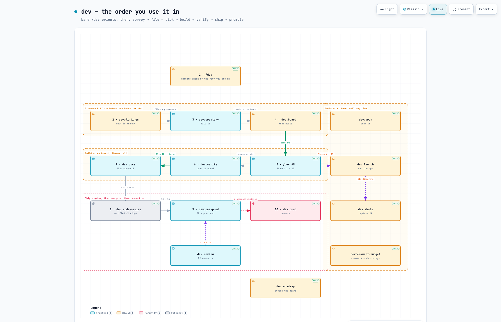

# dev-skill

**From GitHub issue to production, with your coding agent.**

A development workflow that investigates problems, plans solutions, writes code, and verifies changes before release. You approve the key decisions: what to build, which approach to take, when to merge, and when to promote to production.

## Install

Use it as a Mac app, as a skill in your agent CLI, or both. Both come from one clone:

```bash
git clone https://github.com/hasansa007/dev-skill.git
```

This private repository requires GitHub access.

### 1 · The Mac app: Dev Desk

One window holds every project. A strip down the left switches between them, and Home says which one
needs you. Each project shows its board, a workspace for every task, findings, the roadmap and
decisions; each task gets a real shell and its agent, Claude Code or Codex, running in the task's own
worktree. You start an agent yourself, or turn on Auto for a project so it works through the queue —
at most 3 at once, after a token warning you confirm.

**Install and run it** — builds Release, puts it in `~/Applications`, and opens it:

```bash
dev-skill/apps/desk/install.sh          # --no-open to install without launching
```

It builds on your machine, so it needs Xcode and `xcodegen` (`brew install xcodegen`). If you'd
rather not build, take the release below.

**Or download the built app.** The repository is private, so fetch the release with the GitHub CLI:

```bash
gh release download -R hasansa007/dev-skill -p 'Dev-Desk-*.dmg'
```

Open the DMG and drag **Dev Desk.app** onto the `/Applications` symlink inside it. It's ad-hoc signed
rather than notarized, so the first time, right-click the app and choose **Open**. macOS 14 or later;
there is no Windows or Linux build.

For details, see [apps/desk/README.md](apps/desk/README.md).

### 2 · The skill for your agent CLI

**Claude Code — install it as a plugin.** This is the better path, because a plugin carries the
[hooks](hooks/README.md) as well as the doors; the symlink below cannot. The repo is its own
marketplace — `.claude-plugin/marketplace.json` — so point Claude Code at it on GitHub:

```text
/plugin marketplace add hasansa007/dev-skill
/plugin install dev@dev-skill
```

Restart Claude Code, then check the doors are there — `/dev:board`, say. The root door is
**`/dev:dev`** on this path, not `/dev`: a plugin namespaces every skill under its own name, and the
root `SKILL.md` is a skill like the rest. Four hooks come with it: `branch-guard` denies a write on a
protected branch, `pr-gates` checks a PR body and a push, `teardown` blocks a stop while debug Chrome
is alive, and `context-load` injects PROJECT_MAP at session start. `branch-guard` becomes global this
way, which is safe — it exempts the repo it ships in — but it means every repo you work in gets the
protected-branch rule.

**Codex, Antigravity, or Claude Code without the plugin:**

```bash
dev-skill/install.sh
```

The installer links the checkout into existing skill directories for **Claude Code, Codex, and
Antigravity**, skipping any that are missing. It is safe to rerun, and it **skips Claude Code when
the plugin is installed**, so the two never give you every door twice. Installed this way the hooks
do not come with it, and `/dev` keeps its bare name — see [hooks/README.md](hooks/README.md).

**Installing is required, not optional.** Every path inside the family resolves through the install root (`~/.claude/.dev-root/…`), which is what lets it run on any machine regardless of where you cloned it. A clone that has never been installed has no root to resolve against.

Reload skills with `/reload-skills` in Claude Code, or restart your CLI. Check the loaded skill list.

**New here?** [Getting started](docs/guide/GETTING-STARTED.md) walks through the first run and the four situations you can be in — a fresh project, one you know, one you inherited, and picking work up again.

## Start a task

```text
/dev #496
/dev fix the course list losing its scroll position
```

Bare `/dev` **orients**: it detects where the repo actually is and offers the two or three doors that fit — resume work in flight, open the board, stock an empty tracker, or set up a fresh project. It is read-only and never starts work. Examples use Claude Code syntax; see the guide for other CLIs and dependencies.



*Rendered by [Archify](https://github.com/tt-a1i/archify) from `docs/arch/dev-journey.architecture.json`, where every box is pinned to a real file at a real commit. Step 1 is bare `/dev`, which detects which of four situations you are on; the numbered path that follows is the discovery route, for a codebase you do not know. `docs/arch/dev-family.html` has all 21 doors.*

## Commands

### Start or capture work

| Command | Purpose |
| --- | --- |
| `/dev` | Show current issues and suggested next work. |
| `/dev <issue or description>` | Start the full development workflow. |
| `/dev:create-issue` | File a work item for later. |
| `/dev:create-bug` | File a bug report without implementing the fix. |
| `/dev:create-epic` | File a parent epic; split it during planning. |
| `/dev:board` | Show current work, the queue, next tasks and statistics; move, cancel or delete a card. |
| `/dev:findings` | Inspect an app for defects and architectural drift; file the confirmed. |
| `/dev:ideation` | Inspect an app for performance, security and quality opportunities; file the confirmed. |
| `/dev:roadmap` | Propose themes from the repo's own evidence; write milestones and epic parents. |
| `/dev:insights` | Answer a question about the codebase with citations; keep what lasts in `PROJECT_MAP.md`. |

### Continue delivery

| Command | Starting point | Result |
| --- | --- | --- |
| `/dev:verify` | An existing branch | Verification evidence, followed by documentation checks |
| `/dev:docs` | A diff | Documentation and decision checks; PR `## DOCS` content |
| `/dev:code-review` | A branch | Verified review findings, spec-compliance and security passes; Phase 13's gate |
| `/dev:pre-prod` | A branch ready for delivery | PR preparation, review gates, and an approved merge |
| `/dev:review` | A PR with feedback | Addressed feedback and a return to the merge stage |
| `/dev:prod` | Verified pre-production work | Production checks and an approved promotion |
| `/dev:rollback` | A broken production release | Change classification, safe revert with dual-branch sync, and audit trail |
| `/dev:audit` | A branch or PR | Mechanical phase compliance audit against execution evidence |

A full `/dev` run includes these stages. You can also invoke them independently for an existing branch, diff, or PR. Verification continues into documentation checks; merges and production promotion require approval. Code review is `/dev:code-review`, which uses the separate `code-review` integration as its engine.

### App and maintenance tools

| Command | Purpose |
| --- | --- |
| `/dev:launch` | Build and launch the app. |
| `/dev:launch-kill` | Stop this project's servers started by the launch workflow. |
| `/dev:shots` | Capture screens from the running app. |
| `/dev:comment-budget` | Report comments and docstrings that exceed the documentation budget. Add `--apply` to make changes. |
| `/dev:arch` | Generate a diagram tied to verified source locations. Requires Archify. |

See [command examples](docs/guide/COMMANDS.md) for practical usage and handoffs.

### `dev` — the optional helper

A stdlib-only Python helper for the parts that are computable rather than judged. Every command
above works without it; when present, the doors use it instead of doing the same work by hand.

| Command | Purpose |
| --- | --- |
| `dev doctor` | Check the environment: repo, origin, base branch, `gh` auth, install root. |
| `dev board [--json]` | Classify open issues into columns from git and `gh`. |
| `dev state checkpoint\|read\|verify` | Record which pipeline phase a branch reached; `verify` fails when the record disagrees with git. |
| `dev project [--number N] [--apply]` | Mirror the computed board into a GitHub Project v2 board. Dry run unless `--apply`. |
| `dev run <door> [args]` | Dispatch a door to an agent CLI for headless or CI use. Prints the command unless given `--execute`. |

```bash
python3 ~/.claude/.dev-root/scripts/dev.py doctor
```

`install.sh` puts `dev` on your `PATH` by linking it into `~/.local/bin` (or `~/bin`) when one of
those is already on your `PATH`. It never edits your shell profile and never replaces a `dev` that
belongs to another tool — if it can't link, it says so and prints the alias to use instead.

## Learn more

- [Getting started](docs/guide/GETTING-STARTED.md) — first install, first run, and the four situations.
- [User guide](docs/guide/GUIDE.md) — usage, compatibility, and troubleshooting.
- [Workflow](docs/guide/WORKFLOW.md) — phases, approvals, and known limitations.
- [Contributing](docs/guide/CONTRIBUTING.md) — structure, design rules, and maintenance.
- [System model](docs/guide/SYSTEM-MODEL.md) — the five layers, what Dev Desk (the Mac app) reads and runs, and what's not built yet.
