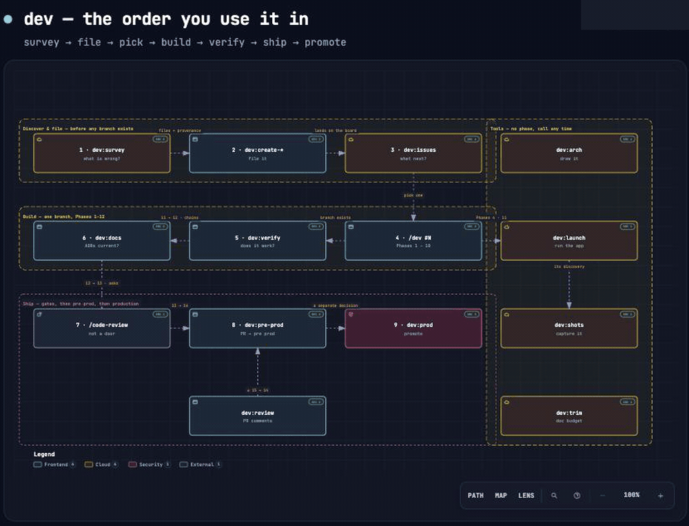

# dev-skill

A personal development workflow for Claude Code: take a GitHub issue or a plain description from
"what should this do?" all the way to production, without skipping the gates that matter.

`/dev` is the full run. **Fifteen members** sit around it: three `/dev:create-*` file the work item
before it starts, five are doors into the same pipeline at later phases for when the work already
exists and only that stage is needed, and seven are **tools** that map to no phase at all.

> **New here? Read [GUIDE.md](GUIDE.md).** Part 1 is what to type and what it will ask you;
> Part 2 is how to change it and what not to. This README is the repo's own structure.

---

## The order you actually use it in

The phase table below is the *reference*. This is the **journey** — what to type, in what order, and
what each door needs before it will do anything.



> The path lights up in the order you walk it: `survey` → file → pick → build → verify → docs →
> `/code-review` → pre prod → prod. Dashed edges are the ones that are never part of a straight run —
> the Phase 15 loop back into 14, and the tools.
>
> Drawn by `/dev:arch`, which pins every box to a file and line range at one commit and verifies it
> against a real Git object. `docs/` is git-ignored **in this repo**, so the explorable HTML is not
> in the clone — regenerate it with `/dev:arch the dev family`. Other repos track theirs normally;
> that is a choice here, not skill behaviour.

| # | You type | When | It needs | It gives you |
|---|---|---|---|---|
| 1 | `/dev:survey` | you don't know what's wrong yet | a repo | a report, then confirmed issues — each naming the run in `## Suspected`, which Phase 4 reads |
| 2 | `/dev:create-issue` · `-bug` · `-epic` | you already know | a description | an issue number |
| 3 | `/dev:issues` *(or bare `/dev`)* | the board is stocked | nothing | what's next, ranked |
| 4 | `/dev #N` | you picked one | an issue number | a branch, a plan, the code |
| 5 | `/dev:verify` | the code exists | a branch | evidence per row → **chains to 6** |
| 6 | `/dev:docs` | before any merge | a diff | the PR's `## DOCS` section |
| 7 | `/code-review` | before any merge | a diff | findings — **not a `dev:` door** |
| 8 | `/dev:pre-prod` | gates are green | a branch | a PR, merged to pre prod |
| 9 | `/dev:prod` | pre prod is verified | both branches | production |

**Steps 1–3 happen before any branch exists.** They take a description and produce an issue number —
nothing durable is being worked on yet, which is why they can run in any session.

**Step 4 is the only one that plans.** Phases 1–10 pass *reasoning* between each other, and reasoning
lives only in the conversation that produced it. That is why there is no door into Phase 6 — there
would be nothing to hand it.

**Steps 5–9 each take a durable artifact** — a branch, a diff, a PR number — which is exactly what
makes them independently invocable. Enter at 5 on Monday and at 8 on Friday; neither needs the other
still in context.

### Data flow — what moves between the doors

```
description ──▶ dev:create-*  ──▶ issue #N ──▶ dev #N ──▶ branch ──▶ dev:verify   ──▶ evidence
                                                              │                        │
repo ──▶ dev:survey ──▶ report ──▶ (confirmed only) ──────────┘                        ▼
                                                                        diff ──▶ dev:docs ──▶ ## DOCS
                                                                                          │
                                             PR #  ◀── dev:pre-prod ◀── /code-review ◀─────┘
                                               │
                        dev:review ◀───────────┘   (loops BACK to 14, never forward)
                                               │
                                               ▼
                                    pre prod ──▶ dev:prod ──▶ production
```

Each arrow is a **durable handoff**. Nothing in that chain requires the previous door's conversation
to still exist — which is the whole reason the family is doors rather than one long run.

### The tools, which sit outside all of it

`dev:launch` · `dev:launch-kill` · `dev:shots` · `dev:arch` · `dev:comment-budget` · `dev:issues` · `dev:survey`
map to **no phase** and run none of the pipeline. Call them whenever. Phases 4 and 11 call `launch`
for mobile targets; `shots` and `launch-kill` are doors into `launch`'s discovery, not copies of it.

### The one automatic hop, and the ones that never are

`dev:verify` (11) → `dev:docs` (12) is the **only** pair that chains without asking: same diff, both
read-only, and their outputs are the two halves of one PR body. Everywhere else the run stops and
asks. **Nothing ever chains into a merge or a promotion** — those are decisions, not steps.

---

## Layout

```
~/Developer/skills/dev-skill/            ← this repo IS the `dev` plugin
├── .claude-plugin/plugin.json    name: dev · skills: ["./"]
├── SKILL.md                      name: dev — the full run; entry routing + family table
├── shared/
│   ├── entry.md                  workspace + pre-prod/prod branch resolution (read by all)
│   ├── pipeline.md               ALL the behavior — Phases 0 → 16
│   ├── pipeline-{web,ios,android,kmp}.md   platform overlays on Phases 10/11/14
│   ├── prod-secrets.md           the releasing merge's secrets gate — Phase 16, or 14 if single-branch
│   └── prod-secrets-apple.md     Apple acquisition steps — read only on a missing secret
├── assets/dev-journey.gif        the map above — tracked, so the README renders
├── docs/                         GIT-IGNORED here. dev:docs writes adr/, dev:arch writes arch/,
│                                 dev:survey writes survey/ — local only, see GUIDE.md to recover
├── .github/workflows/
│   └── line-budget.yml           the repo's ONLY mechanical PR check — recomputes the GUIDE ceiling
├── ci/pr-gates.yml               required-sections job NOT installed (PRs here are not /dev runs);
│                                 its line-budget job IS, above
├── hooks/                        4 Claude Code hooks — Phases 1, 3, 11(teardown), 12, 14, 16
│   └── README.md                 what a hook can enforce, install blocks, the fired.log query
├── web/  mobile/                 architecture + feature prompts (conditional)
└── skills/
    ├── create-bug/SKILL.md       → /dev:create-bug    Phase 0
    ├── create-issue/SKILL.md     → /dev:create-issue  Phase 0
    ├── create-epic/SKILL.md      → /dev:create-epic   Phase 0
    ├── verify/SKILL.md           → /dev:verify     Phase 11
    ├── docs/SKILL.md             → /dev:docs       Phase 12
    ├── pre-prod/SKILL.md         → /dev:pre-prod   Phase 14
    ├── review/SKILL.md           → /dev:review     Phase 15  ↺
    ├── prod/SKILL.md             → /dev:prod       Phase 16
    ├── launch/SKILL.md           → /dev:launch     no phase — a TOOL
    ├── launch-kill/SKILL.md      → /dev:launch-kill  no phase — `launch` inverted
    ├── shots/SKILL.md            → /dev:shots      no phase — capture, iOS/Android/web
    ├── comment-budget/SKILL.md   → /dev:comment-budget  no phase — existing code → the doc budget
    ├── arch/SKILL.md             → /dev:arch       no phase — a verifiable diagram, via Archify
    ├── survey/SKILL.md           → /dev:survey     no phase — read the app, file what is wrong
    └── issues/SKILL.md           → /dev:issues     no phase — the tracker view; bare /dev routes here
```

Every phase skill reads `shared/pipeline.md`. **None of them copies it.** Behavior changes go in
`shared/`, once.

### Three tools of a different kind

The phase members are doors into `shared/pipeline.md`. `dev:launch`, `dev:launch-kill` and
`dev:shots` are **tools**: no phase number, no preamble. Three verbs on one noun — start it, stop it,
shoot it — and the latter two are doors into `launch`, not copies. That is how `shots` inherits the
rule that matters for a capture: *if a server is already listening, reuse it and start nothing.*

`launch-kill` adds the **boundary** — it proves a process belongs to *this worktree* before touching
it, then kills the tree from the top so the launch script's traps fire. The leaked-`worker.py`
incident that forced this is in [`skills/launch-kill/SKILL.md`](skills/launch-kill/SKILL.md).

Not named `run`: Claude Code ships a built-in `run` skill. `dev:launch` lives here because it is the
pipeline's only **personal-skill** dependency — everything else installs anywhere; this one would
simply be missing after a clone. [`dev:arch`](skills/arch/SKILL.md) is a third category: it depends
on [Archify](https://github.com/tt-a1i/archify) and stops rather than drawing something unvalidated.

Phase 11 should delegate its capture to `dev:shots` rather than restate the commands. That edit is
**not** made: `shared/pipeline.md` sits at 995 against a 995-line budget, so `GUIDE.md` requires an
addition there to name its deletion.

---

## Installing

This is a **skills-dir plugin**: a plugin living directly in `~/.claude/skills/`, with no
marketplace and no `~/.claude/plugins/cache/`. One symlink installs the whole family.

```bash
ln -sfn ~/Developer/skills/dev-skill  ~/.claude/skills/dev
```

It auto-loads next session as `dev@skills-dir`; `/reload-plugins` loads it immediately. Members
then invoke as `/dev:verify`, `/dev:launch`, and so on — **the namespace comes from
`.claude-plugin/plugin.json`, not from the directory names**, which is why the members are called
`verify` and `launch` rather than `dev-verify` and `dev-launch`.

Without that manifest the same tree registers **nothing**: plain skill discovery is flat
(`~/.claude/skills/<name>/SKILL.md`, exactly one level) and would never look inside `skills/`.
The manifest is the single file that turns a nested directory into a namespace.

**Verify against the loaded skill list, not the filesystem.** A `SKILL.md` on disk proves nothing
about registration — check `claude plugin list` and the session's skill list.

---

## The pipeline

| Phase | | Sibling |
|---|---|---|
| **0** | **Filing** — draft, resolve real labels, create. Standalone only; a `/dev` run never reaches it. `dev:survey` files through these | `dev:create-*` |
| 1 | Context Load — `PROJECT_MAP.md`, `ARCHITECTURE.md`, existing spec | |
| 2 | Tech Stack & Discovery — stack detect, conditional explorer fan-out | |
| 3 | Git Branch Naming | |
| 4 | Investigation — evidence ladder, reproduce before theorising; a `dev:survey` issue starts at layer 3, never skips 3–5 | |
| **5** | **Discuss Before Building** — plain-language, explicit go-ahead; **asks for YOUR approach before showing its own**; conditional UI discussion **and epic decomposition** | |
| 6 | Architecture Alternatives — 3 forced-different biases, losers recorded | |
| 7 | Plan Output — written to `specs/` | |
| 8 | Task Breakdown | |
| 9 | Implement — surgical protocol | |
| 10 | Pre-PR Quality Checks | |
| **11** | **Verification Gate** — agent-run, evidence per row, teardown → chains to 12 | `dev:verify` |
| **12** | **Docs & Decisions Gate** — ADRs before merge | `dev:docs` |
| 13 | Code Review Gate — `/code-review`, + `security-review` on Deep | |
| **14** | **PR → Review → Merge → Pre Prod** | `dev:pre-prod` |
| **15** | **Review Cycle** — a LOOP back into Phase 14, never forward | `dev:review` |
| **16** | **Prod Promotion** — secrets pre-flight, then migrations, never autonomous | `dev:prod` |
| — | *(no phase)* — build & launch the app | `dev:launch` |
| — | *(no phase)* — stop this project's servers | `dev:launch-kill` |
| — | *(no phase)* — capture screens from the running app | `dev:shots` |
| — | *(no phase)* — bring EXISTING code to the documentation budget | `dev:comment-budget` |
| — | *(no phase)* — draw a verifiable diagram of a system | `dev:arch` |
| — | *(no phase)* — survey an existing app, file the confirmed findings. **Feeds Phase 0** via `dev:create-*`, and Phase 4 reads the provenance it writes | `dev:survey` |
| — | *(no phase)* — the tracker: current, next, stats | `dev:issues` |

### Why these phase members and not others

Phases 1–8 pass **reasoning**, which lives only in the conversation that produced it. From Phase 11
on, every phase takes something durable — a branch, a diff, a PR number — which is what makes it
independently invocable. Phase 0 qualifies from the other side: it runs *before* any reasoning
exists. Phase 13 is deliberately absent — it is twenty lines that mostly say "run `/code-review`".

Fuller version, with the four other design ideas:
[GUIDE.md → The five ideas the design turns on](GUIDE.md#the-five-ideas-the-design-turns-on).

---

## Design rules

- **Right-size first.** Every task is triaged Light / Standard / Deep before starting, and the tier
  is stated. Light is the default. *A slow pipeline that gets skipped protects nothing.*
- **It runs straight through; there is no mode question.** Phases 5, 6, 14 and 16 stop regardless —
  those are decisions, not steps. Running automatically skips the ceremony, never the judgment.
- **Never end silently.** Wherever a run stops — the last phase, a gate, a blocker — it names the
  next phase and asks. Entering at Phase 12 never leaves you guessing what followed it.
- **Skipping leaves a trace.** Every PR carries `## PIPELINE`: tier, what ran, what was skipped and
  **why**, and what each gate caught. It is also the only record of whether a rule ever earned its
  place, which is what makes rules removable.
- **Pre prod ≠ prod.** Phase 14 reaches pre prod only. Promotion is Phase 16, needs its own
  confirmation, and never happens autonomously.
- **Evidence before assertions.** No "should work" — run it, read the output, paste what it printed.
- **Docs before merge.** A price, limit, decision or env var that changed without its ADR is an
  unfinished diff.
- **One pipeline, many doors.** Members never copy `shared/pipeline.md`; they point into it.
- **The resolved repo is a write boundary.** Name the target `owner/repo` and branch *before* acting;
  cut the branch from the resolved pre-prod branch, not from what is checked out.
- **A result is not a claim.** Say what a command's output *means* and what bounds it — not just
  where you looked. Catches the plausible non-empty result that answered a narrower question.

Both are defined once in [`shared/entry.md`](shared/entry.md), which every door reads.

---

## Editing

Edit here — `~/.claude/skills/dev` symlinks to this repo. After changing anything under
`shared/`, every phase skill picks it up with no further action.
