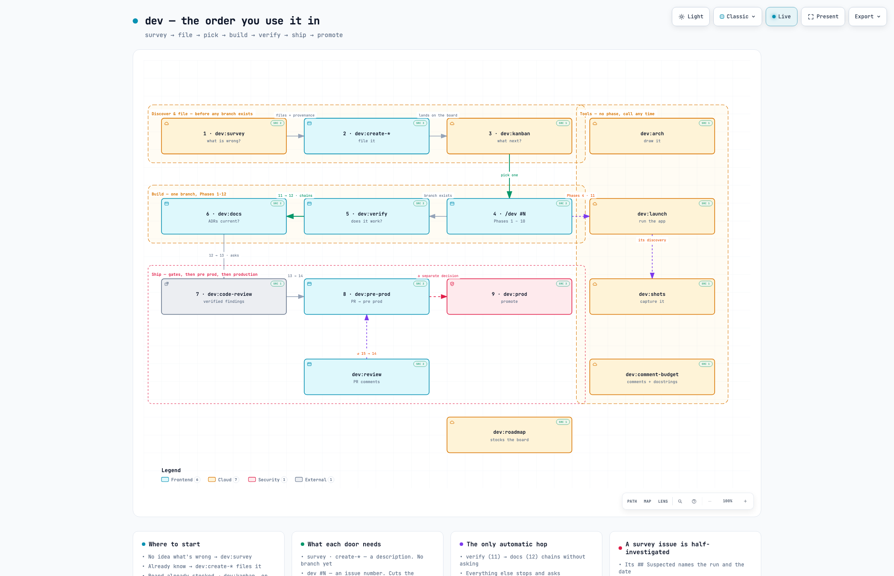

# dev-skill

**From GitHub issue to production, with your coding agent.**

A development workflow that investigates problems, plans solutions, writes code, and verifies changes before release. You approve the key decisions: what to build, which approach to take, when to merge, and when to promote to production.

## Install

```bash
git clone https://github.com/hasansa007/dev-skill.git && dev-skill/install.sh
```

This private repository requires GitHub access. The installer links the checkout into existing skill directories for **Claude Code, Codex, and Antigravity**, skipping missing directories. It is safe to rerun.

**Installing is required, not optional.** Every path inside the family resolves through the install root (`~/.claude/skills/dev/…`), which is what lets it run on any machine regardless of where you cloned it. A clone that has never been installed has no root to resolve against.

Reload skills with `/reload-skills` in Claude Code, or restart your CLI. Check the loaded skill list.

## Start a task

```text
/dev #496
/dev fix the course list losing its scroll position
```

Bare `/dev` shows current issues and suggested next work. Examples use Claude Code syntax; see the guide for other CLIs and dependencies.



*Rendered by [Archify](https://github.com/tt-a1i/archify) from `docs/arch/dev-journey.architecture.json`, where every box is pinned to a real file at a real commit. It shows the linear path; `docs/arch/dev-family.html` has all 20 doors.*

## Commands

### Start or capture work

| Command | Purpose |
| --- | --- |
| `/dev` | Show current issues and suggested next work. |
| `/dev <issue or description>` | Start the full development workflow. |
| `/dev:create-issue` | File a work item for later. |
| `/dev:create-bug` | File a bug report without implementing the fix. |
| `/dev:create-epic` | File a parent epic; split it during planning. |
| `/dev:kanban` | Show current work, the queue, next tasks and statistics; move, cancel or delete a card. |
| `/dev:survey` | Inspect an app for defects and architectural drift; file the confirmed. |
| `/dev:ideation` | Inspect an app for performance, security and quality opportunities; file the confirmed. |
| `/dev:roadmap` | Propose themes from the repo's own evidence; write milestones and epic parents. |
| `/dev:insights` | Answer a question about the codebase with citations; keep what lasts in `PROJECT_MAP.md`. |

### Continue delivery

| Command | Starting point | Result |
| --- | --- | --- |
| `/dev:verify` | An existing branch | Verification evidence, followed by documentation checks |
| `/dev:docs` | A diff | Documentation and decision checks; PR `## DOCS` content |
| `/dev:code-review` | A branch | Verified review findings, spec-compliance and security passes; Phase 13's gate |
| `/dev:pre-prod` | A branch ready for delivery | PR preparation, review gates, and an approved merge |
| `/dev:review` | A PR with feedback | Addressed feedback and a return to the merge stage |
| `/dev:prod` | Verified pre-production work | Production checks and an approved promotion |
| `/dev:rollback` | A broken production release | Change classification, safe revert with dual-branch sync, and audit trail |
| `/dev:audit` | A branch or PR | Mechanical phase compliance audit against execution evidence |

A full `/dev` run includes these stages. You can also invoke them independently for an existing branch, diff, or PR. Verification continues into documentation checks; merges and production promotion require approval. Code review is `/dev:code-review`, which uses the separate `code-review` integration as its engine.

### App and maintenance tools

| Command | Purpose |
| --- | --- |
| `/dev:launch` | Build and launch the app. |
| `/dev:launch-kill` | Stop this project's servers started by the launch workflow. |
| `/dev:shots` | Capture screens from the running app. |
| `/dev:comment-budget` | Report comments and docstrings that exceed the documentation budget. Add `--apply` to make changes. |
| `/dev:arch` | Generate a diagram tied to verified source locations. Requires Archify. |

See [command examples](documentation/COMMANDS.md) for practical usage and handoffs.

### `dev` — the optional helper

A stdlib-only Python helper for the parts that are computable rather than judged. Every command
above works without it; when present, the doors use it instead of doing the same work by hand.

| Command | Purpose |
| --- | --- |
| `dev doctor` | Check the environment: repo, origin, base branch, `gh` auth, install root. |
| `dev board [--json]` | Classify open issues into columns from git and `gh`. |
| `dev state checkpoint\|read\|verify` | Record which pipeline phase a branch reached; `verify` fails when the record disagrees with git. |
| `dev run <door> [args]` | Dispatch a door to an agent CLI for headless or CI use. Prints the command unless given `--execute`. |

```bash
python3 ~/.claude/skills/dev/scripts/dev.py doctor
```

## Learn more

- [User guide](documentation/GUIDE.md) — usage, compatibility, and troubleshooting.
- [Workflow](documentation/WORKFLOW.md) — phases, approvals, and known limitations.
- [Contributing](documentation/CONTRIBUTING.md) — structure, design rules, and maintenance.
